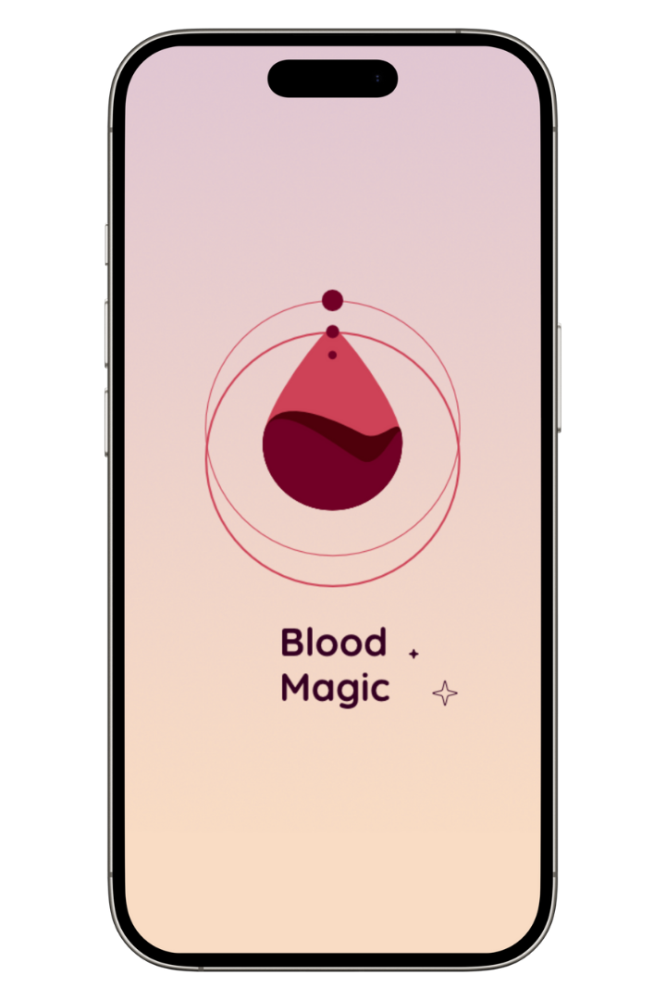
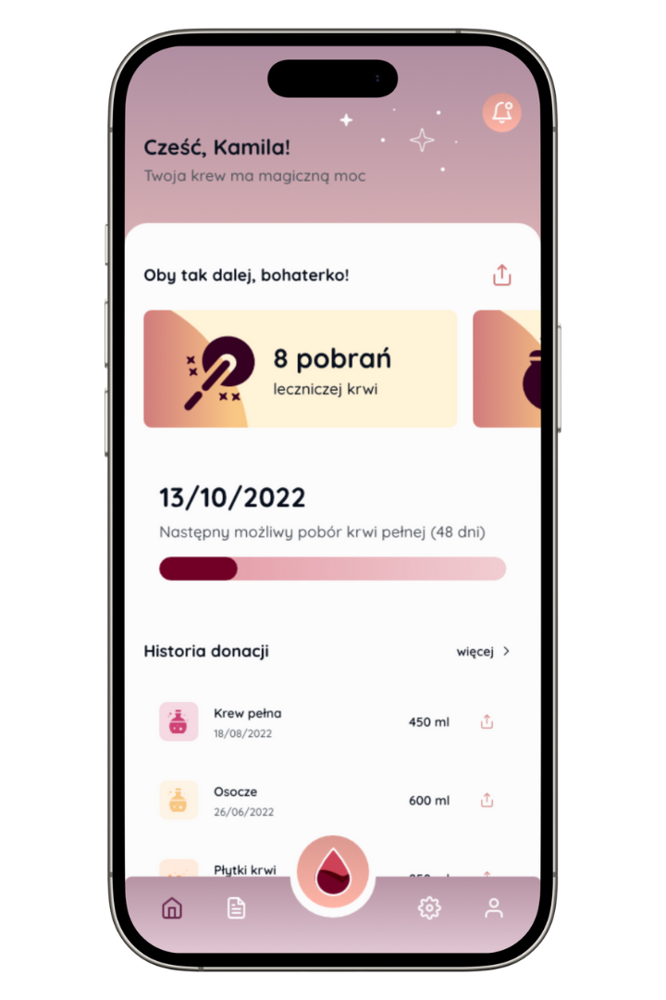
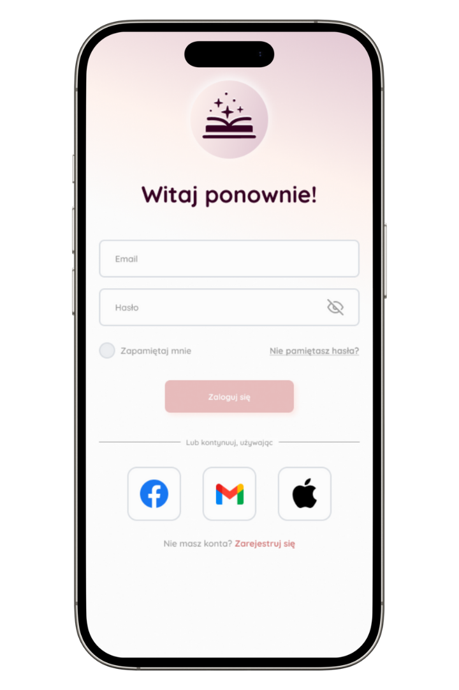
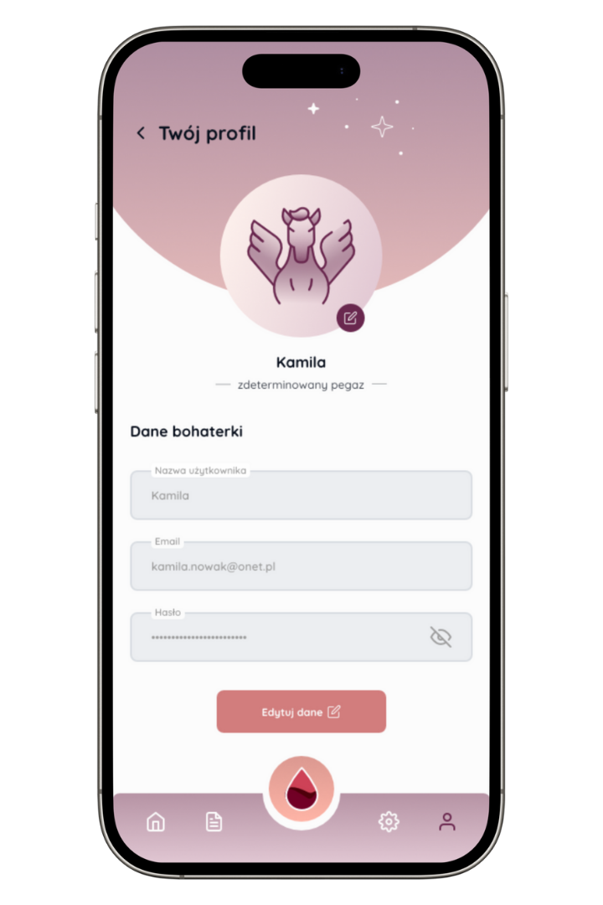
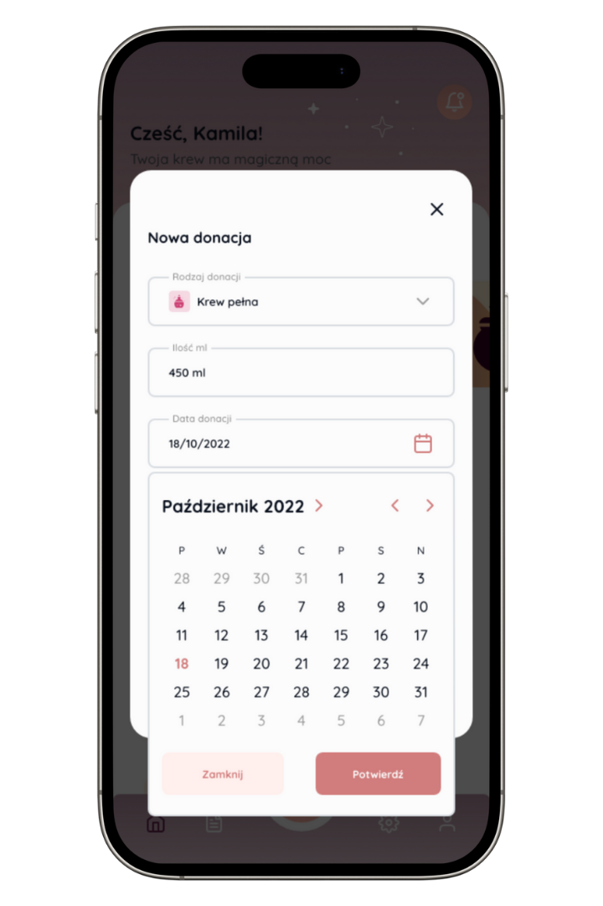

# Blood magic - aplikacja dla Krwiodawców w Polsce do śledzenia donacji

## Screenshots

## [PL] O Aplikacji

Aplikacja służy jako prosty tracker donacji krwi dla honorowych krwiodawców w Polsce. Zachowywane są podstawowe informacje o donacji, tj.: ilość (w mililitrach), poziom hemoglobiny, ciśnienie, data oraz miejsce (Centrum Krwiodawstwa) donacji. Dostarcza również informacji o Centrach Krwiodawstwa - miejscach, gdzie honorowo można oddać krew.

### Zgłoszenia błędów/sugestii

Błędy oraz sugestie można zgłaszać bzpośrednio w [issues](https://github.com/emce/blood-magic/issues) (wymagane konto w GitHub), albo korzystając z [formularza](https://magiakrwi.cwiklin.ski/app/zgloszenie/).

### Wersja webowa

Można również skorzystać z nieco już zdezaktualizowanej (lub jeszcze niezaktualizowanej 😂) wersji webowej pod [tym adresem](https://magiakrwi.cwiklin.ski).

### Linki do pobrania

| Aplikacja dla systemu Android: | Aplikacja dla systemu iOS (iPhone/iPad) | Aplikacja dla systemu MacOS |
| ----------- | ----------- | ----------- |
| [Play Store](https://play.google.com/store/apps/details?id=mobi.cwiklinski.bloodline) | [App Store](https://apps.apple.com/pl/app/blood-donor-diary/id1563904745?platform=iphone) | [Mac App Store](https://apps.apple.com/pl/app/blood-donor-diary/id1563904745?platform=mac) |
|  |  |  |

## [EN] About Application

The application serves as a simple blood donation tracker for honorary blood donors in Poland. Basic information about the donation is saved, i.e.: quantity (in milliliters), hemoglobin level, blood pressure, date and place (Blood Donation Center). It also provides information about Blood Donation Centers - places where you can donate blood honorarily.

### Bug reports/suggestions

Bugs and suggestions can be reported directly in [issues](https://github.com/emce/blood-magic/issues) (GitHub account required), or using the [form](https://magiakrwi.cwiklin.ski/app/zgloszenie/).

### Web application

You can also use the slightly outdated (or not yet updated 😂) web version at [this address](https://bloodmagic.cwiklin.ski).

### Download links

|  Android application: | iOS application (iPhone/iPad) | MacOS application |
| ----------- | ----------- | ----------- |
| [Play Store](https://play.google.com/store/apps/details?id=mobi.cwiklinski.bloodline) | [App Store](https://apps.apple.com/pl/app/blood-donor-diary/id1563904745?platform=iphone) | [Mac App Store](https://apps.apple.com/pl/app/blood-donor-diary/id1563904745?platform=mac) |
|  |  |  |

## Technical information
### Before running!
 - check your system with [KDoctor](https://github.com/Kotlin/kdoctor)
 - install JDK 17 or higher on your machine
 - add `local.properties` file to the project root and set a path to Android SDK there

### Android
Aby przygotować aplikację:
 - uruchom `./gradlew :composeApp:assembleDebug`
 - znajdź plik `.apk` w `shared/build/outputs/apk/debug/composeApp-debug.apk`
Run android UI tests on the connected device: `./gradlew :composeApp:connectedDebugAndroidTest`

### Desktop
Aby uruchomić aplikację: `./gradlew :shared:run`
Aby uruchomić testy: `./gradlew :shared:jvmTest`
Aby wybudowac aplikację, uruchom: `./gradlew clean :shared:packageReleaseDistributionForCurrentOS -PmacOsAppStoreRelease=true`

### iOS
Aby przygotować i uruchomić aplikację  na urządzeniu/emulatorze:
 - Otwórz `iosApp/iosApp.xcproject` w Xcode i uruchom
- Albo użyj [Kotlin Multiplatform Mobile plugin](https://plugins.jetbrains.com/plugin/14936-kotlin-multiplatform-mobile) dla Android Studio
Aby uruchomić testy UI: `./gradlew :shared:iosSimulatorArm64Test`

### Resource
Aby przebudować zasoby uruchom:
`./gradlew :shared:generateResourceAccessorsForCommonMain`

### Libraries
Aby wygenerować plik z listą bibliotek, uruchom:
`./gradlew share:exportLibraryDefinitions -PaboutLibraries.exportPath=src/commonMain/composeResources/files -PaboutLibraries.exportVariant=release`

